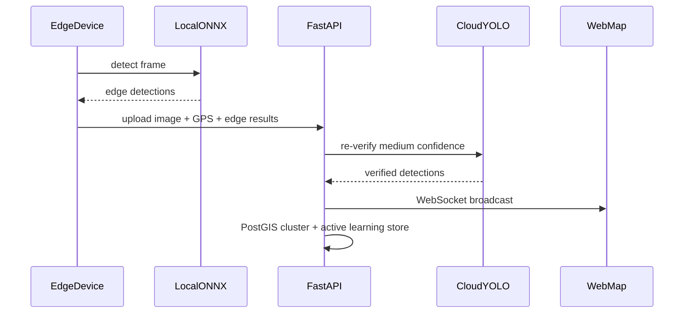

# Pothole AI Detection System

نظام متكامل للكشف عن الحفر في الشوارع باستخدام الذكاء الاصطناعي، مع دعم الهاتف وMMS والدرون، وعرض النتائج على خريطة OpenStreetMap مجانية في الوقت الفعلي.

## المكونات

| المكون | المسار | الوصف |
|--------|--------|-------|
| Backend API | `backend/` | FastAPI + PostGIS + WebSocket + inference هجين |
| ML Pipeline | `ml/` | تجميع datasets، تدريب YOLO، تصدير ONNX |
| Web Dashboard | `web-dashboard/` | React + Leaflet + OSM + تحديث فوري |
| Edge SDK | `edge-sdk/` | Python SDK لـ MMS والدرون |
| Mobile App | `mobile/` | Expo — كاميرا + GPS + رفع هجين |

## البدء السريع

### 1. قاعدة البيانات (PostGIS)

```bash
docker compose up -d db
```

### 2. Backend

```bash
cd backend
python -m venv .venv
.venv\Scripts\activate        # Windows
pip install -r requirements.txt
copy .env.example .env
uvicorn app.main:app --reload --port 8000
```

### 3. لوحة الويب

```bash
cd web-dashboard
npm install
npm run dev
```

افتح: http://localhost:5173

### 4. تجميع البيانات وتدريب النموذج

```bash
# تعليمات تحميل datasets
python ml/scripts/download_datasets.py

# ضع البيانات في data/datasets/raw/{rdd2022,roboflow,kaggle,cdnet}
python ml/dataset_aggregator.py
python ml/train.py --epochs 50
python ml/export_onnx.py
```

### 5. Edge SDK (MMS / Drone)

```bash
cd edge-sdk
pip install -e .
python examples/mms_drone_example.py --image sample.jpg --lat 30.04 --lon 31.23 --device drone
```

### 6. تطبيق الموبايل

```bash
cd mobile
npm install
npx expo start
```

## التشغيل الكامل بـ Docker

```bash
docker compose up --build
```

- API: http://localhost:8000
- Dashboard: http://localhost:5173
- PostGIS: localhost:5432

## تدفق الكشف الهجين



## API Endpoints

| Method | Path | الوصف |
|--------|------|-------|
| GET | `/api/health` | فحص الصحة |
| GET | `/api/detections?min_lat&min_lon&max_lat&max_lon` | كشوفات في نطاق الخريطة |
| GET | `/api/detections/recent` | آخر الكشوفات |
| GET | `/api/detections/stats` | إحصائيات |
| POST | `/api/detections` | إرسال كشف يدوي |
| POST | `/api/detections/upload` | رفع صورة/فيديو + كشف |
| WS | `/ws/detections` | تحديثات فورية |

## Datasets المدعومة

- **RDD2022** — Japan, India, Czech, China, Norway, US
- **Roboflow** — Pothole YOLO exports
- **Kaggle** — Pascal VOC pothole datasets
- **CDNet** — MMS simulation data

## الترخيص

MIT — للاستخدام التعليمي والبحثي.
